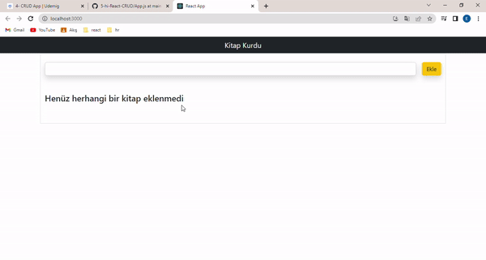

<h1>Bookstore</h1>

React and boottrap used

<h2> Screen shot</h2>

<h1>CRUD App</h1>

Create Read Update Delete

Oluştur oku düenle sil

<ul>
    <li>Proje bootstapi dahil et. Yani index.htmle bootstrap cdni ekle</li>
    <li>
        1. Yeni eklenecek elemeanı almak için form oluştur;
        form içerisinden gelen verileri al ve state'e aktar;
        ekle butonuna basıldıği anda forma girilen bilgilerle beraber yeni bir obje olustur.
        Oluşturulan objenin değerleri: tarih, kitap ismi, id, okundumu bilgişi,
        Oluşan onjeyi kitaplar işminde bir diziye aktar.
        Obje oluşturulduktan sonra inputu sıfırla.
    </li>
    <li>
        2- books state'inde tutulan kitapları al ve map metodu ile listele
        > eğer state boşsa ekrana henüz kitap eklenmedi yaz
        >BookCard bileşenine kitap bilgilerini prop olarak gönder
        >BookCard bileşeninin kitapla ilgili bütün özelliklerini göster
    </li>
    <li>
        3-Kitap silme:
        >herhangi bir kitabın sil butonuna baıldığında
        >çalışan fonksiyonun ilinecek olanın idsi gitsin
        >gelen idyi fonksiyone parametre olarak da al
        > silinecek idye eşit olmayan objeleri statee aktar.
        >oluşan diziyi statee aktar.
    </li>
    <li>
        4-Kitabı okunda olarak işaretle.
        >okundu butonuna basılınca çalışan fonksiyona kitabı gönder
        >kitabın isRead değerini terine cevir.
        >dizi içerisinde degişecek elemanı bul 
        >o elemanı çıkar ve yerine yenisini ekle
        
    </li>
    <li>
        5-Düzenleme işlemini yap:
        <düzenle butonuna tıklandığında ekrana bir modal çıkar
        >düzenlenecek kitabı app.jse aktarsın
        >Modalda Kitap ismini değiştirmek için bir input
        >input her degitiginde editItem değişkenini günceller ve app.jse aktarır
        >vazgec butonu >modalı kapatır 
        >kaydet butonu> app.jsde bulunan handleEditBook çalıştırır.
        >çalışan fonkiyon diziden eski elamnı çıkarır yerine yenisini koyar
        /li>
</ul>